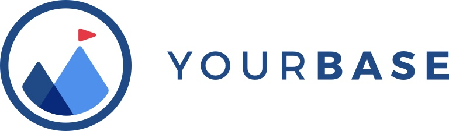

[](https://slack.yourbase.io)

`yb build all-the-things!`

YourBase is a build tool that makes working on projects much more delightful. Stop worrying
about dependencies, keep your CI build process in-sync with your local
development process and onboard new team members with ease.

The primary features of the YB tooling are:

* *Consistent local and CI tooling* How a project is built as part of the
  CI/CD process should not be any different than how it is built on a
  developer's machine. Keeping tooling in-sync means predictable results and 
  a better developer experience for everyone. (Although local builds are not 
  fully isolated yet)

* *Accelerated on-boarding* Many projects have long sets of instructions that 
  are required for a developer to get started. With YB, the experience is as 
  simple as getting source code and running `yb build` - batteries included!

* *Programmatic dependency management* No need to have developers manually
  install and manage different versions of Go, Node, Java, etc. By describing
  these tools in codified build-packs, these can be installed and configured 
  automatically on a per-project basis. Manage containers and other runtime 
  dependencies programmatically and in a consistent manner. 

* *Remote builds* Run your work and tests in the cloud just like you would 
  locally or as part of CI! Stream the results back to your machine in real-time
  to offload the work.


# How to use it

1. Download and install `yb` from https://dl.equinox.io/yourbase/yb/stable - alternatively, build the code in this repository using `go build` with a recent version of go. 
2. Clone a package from GitHub 
3. Write a simple build manifest (more below)
4. Build awesome things!

# Getting Started

To use yb you need a `.yourbase.yml` file in your repository with
enough information to build your project:

## Example .yourbase.yml

```
dependencies:
   build:
     - python:3.6.3

build_targets:
   - name: default
     commands:
       - pip install -r requirements.txt
       - python tests/run_tests.py 

ci:
  builds:
    - name: tests
      build_target: default
```

The YourBase config was designed from the ground up to be a fast, composable
and easy to use method to declare build targets. Targets defined in the config
are built in an isolated and uniform container, so local builds are similar to
remote builds.

The YourBase YAML replaces both legacy CI configs and container build
configuration formats like Dockerfile. It uses containers underneath and you can
still run things on the side like MySQL, Postgres, Redis or any service from a
container image.

For more examples and a complete reference to the YAML configuration syntax,
see https://docs.yourbase.io/configuration/yourbase_yaml.html

## Test the .yourbase.yml

You can test the configuration locally before committing it by calling `yb checkconfig` in the the root directory of your repository:

`yb checkconfig`

Make sure you have a `.yourbase.yml` file in that directory.

## Run your first local build

If you created a `default` target, you can build it with:

`yb build`

Or if you have a different `build_target`, try:

`yb build <target name>`

## Run the first remote build

To use remote builds, first you have to sign-in to YourBase.io with. Run this to get a sign-in URL:

`yb login`

Then try to run a remote build. To build the `default` target, just do:

`yb remotebuild`

or if you have a different target in your config:

`yb remotebuild <target>`

You can watch the build/test stream both locally and in the build dashboard at https://app.yourbase.io

## Triggering Builds from GitHub pushes

You can also build code after it's pushed to a GitHub repository. Install the
  free `YourBase Accelerated CI app for GitHub` at https://github.com/apps/yourbase. 

Then push any change to GitHub, on any branch. If the `.yourbase.yml` file is in that change and is valid, you should see your build in the dashboard.

  - YourBase GitHub app: https://github.com/apps/yourbase
  - Dashboard: https://app.yourbase.io

### Build Conditions

By default, the YourBase Accelerated CI runs the specified build targets whenever there is
a GitHub push event. You can change it to only build after certain events,
by specifying conditions for build service builds:

```
   ci:
     builds:
       - name: tests
         build_target: default
         when: branch is 'master' OR action is 'pull_request'
```

# Documentation

See the complete documentation and configuration reference at http://docs.yourbase.io.

# Self-update

To update to a new *stable* version of yb, use:

`yb update`

# Using non-stable versions:

You can change yb to other channels by using `-channel`:

`yb update -channel=preview`

Currently, the _inner_ yb that runs inside the build container will use the stable channel by default. To change that, set the environment variable `YB_UPDATE_CHANNEL=unstable` before running yb.

# Contributing 

We welcome contributions to this CLI, please see the CONTRIBUTING file for more
information. 

# License 

This project is licensed under the Apache 2.0 license, please see the LICENSE
file for more information.

