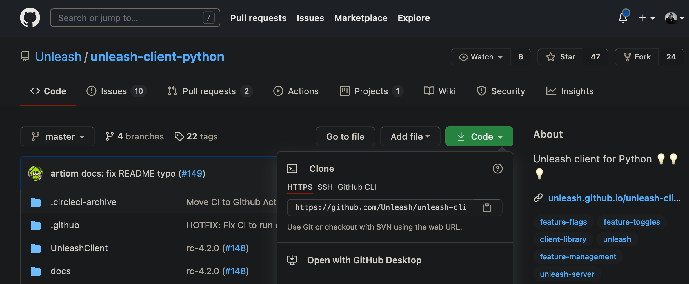
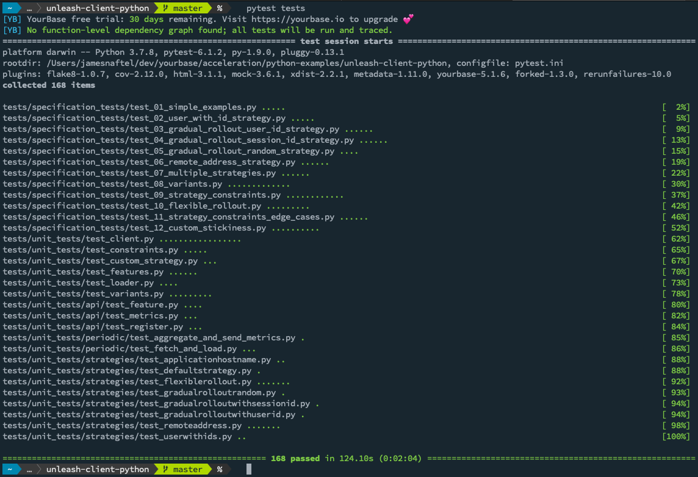
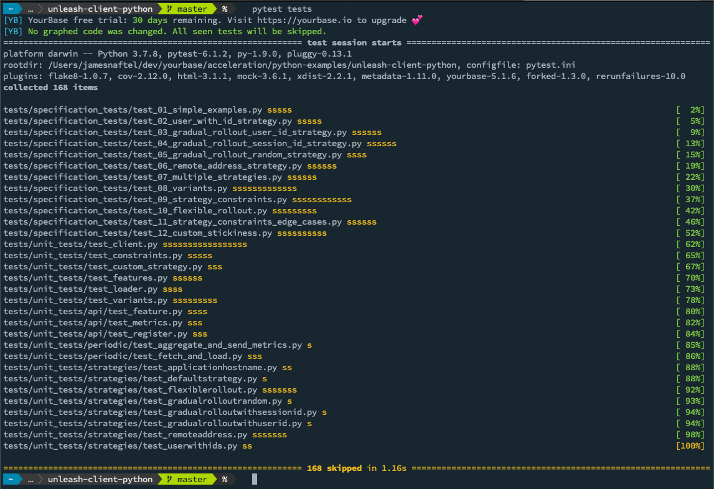
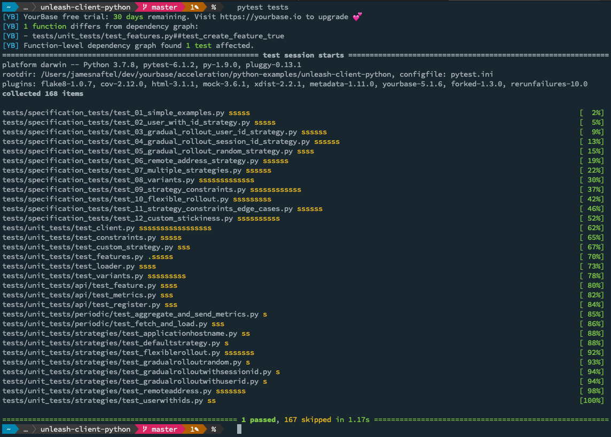
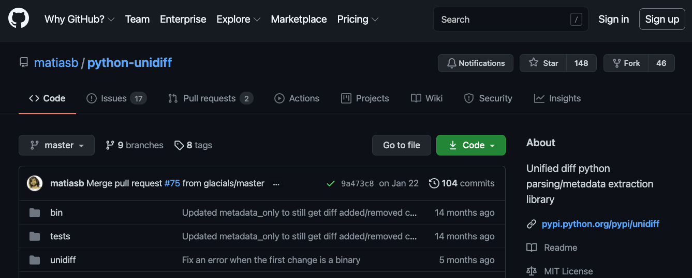
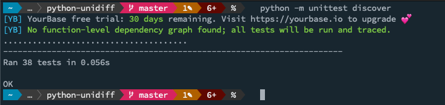
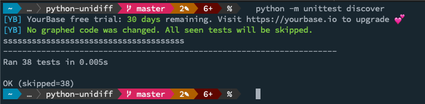
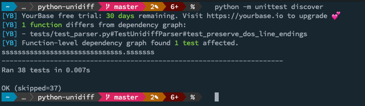

# Getting Started with Python Test Acceleration

YourBase Test Acceleration is a plug-in that automatically determines which
tests need to run based on which changes were made to code.

All it takes to get started is a `pip install yourbase`.

## Table of Contents
  * [Accelerate Tests Locally](#accelerate-tests-locally)
    + [pytest](#pytest)
    + [unittest](#unittest)
  * [Set up Shared Dependency Graph](#set-up-shared-dependency-graph)
    + [Introduction](#introduction)
    + [Setup](#setup)
    + [For use in a CI](#for-use-in-a-ci)
  * [Support for Parallelized Tests](#support-for-parallelized-tests)
  * [Product Usage Data](#product-usage-data)

## Accelerate Tests Locally

YourBase intelligent test selection for Python comes in the form of a library
that can be installed from PyPI using `pip` or `poetry` with a single command.
The first time you run your tests with YourBase, a _Dependency Graph_ will be
automatically built that maps which files and functions your tests depend on.
After making a change and re-running your tests, YourBase will load the optimal
dependency graph and use that information to intelligently select which tests
need to be run based on the changes that have been made to your source code.

YourBase has support for both `pytest` and `unittest` - you can see examples of
both below, depending on the test framework you use. For further information you
can also refer to the [PyPI documentation page][].

[pypi documentation page]: https://pypi.org/project/yourbase/

### pytest

YourBase is bundled with hooks for the pytest framework; to use it you run
`pip install yourbase` or add `yourbase` to your `requirements.txt` before
running `pip install -r requirements.txt` (or equivalent, `poetry` will also
work just fine). This installs the YourBase test selection library, which
includes a pytest plugin that will be automatically discovered by pytest without
any additional configuration. Once it has been installed, the plugin will be
loaded for any invocation of pytest that uses the python installation.

For those who want to get started with an existing project, you can follow along
with the below example, using the `unleash-client-python` project to demonstrate
how things work.

1. Checkout the project:
   `git clone https://github.com/Unleash/unleash-client-python`

   

2. (Optional) Create a virtual environment for this demonstration if you want to
   use a clean Python environment (macOS / Linux can use `python -m venv .venv`
   and activate it with `source .venv/bin/activate` ; Windows users can use
   `python -m venv .venv` and then activate it with `source .venv/scripts/activate`)

3. Install the YourBase Python library using `pip install yourbase`

4. Run the Unleash client's tests using `pytest tests` - as you will see, this
   executes all of the tests and builds an initial dependency graph.

   

5. Run `pytest tests` again (making no code changes to the project) - this time
   you will see that no code has changed and all the tests will be skipped, as
   the outcome will be the same as before.

   

6. Make a minor change to a source file; in our example we have modified the
   function `test_create_feature_true` in the `tests/unit_tests/test_features.py`
   file.

7. Run `pytest tests` again, this time you will see a message telling you which
   functions have been altered and how many tests were affected. If you modified
   the same function as above then your output will closely match the output
   below in which only one test gets re-run, while 167 of them are skipped,
   bringing our test time down from 2 minutes to 1 second.

   

8. Feel free to experiment with other functions in the source tree and see what
   happens, then go ahead and use `yourbase` in your own project!

### unittest

YourBase comes bundled with hooks that will automatically detect when `unittest`
is being used and automatically take care of loading itself without any
additional action on your part. These hooks intercept the existing unittest
setup and teardown handlers in order to provide test acceleration.
Run `pip install yourbase` or add `yourbase` to your `requirements.txt` before
running `pip install -r requirements.txt` in order to install the test selection
library.

For those wanting to get started with an example project, the following example
will get you up and running with minimal fuss by using the `python-unidiff`
project (which uses `unittest` to run its tests).

1. Check out the project: `git clone https://github.com/matiasb/python-unidiff.git`

   

2. (Optional) Create a virtual environment for this demonstration if you want to
   use a clean Python environment (macOS / Linux can use `python -m venv .venv`
   and activate it with `source .venv/bin/activate` ; Windows users can use
   `python -m venv .venv` and then activate it with `source .venv/scripts/activate`)

3. Install the YourBase Python library using `pip install yourbase`

4. Update `tests/__init__.py`

   ```python
   import unittest
   import yourbase

   yourbase.attach(unittest)
   ```

5. Run `python -m unittest discover`

   

6. Run `python -m unittest discover` a second time with no changes to the
   `python-unidiff` code files; observe that all tests will be skipped because
   there have been no code changes.

   

7. Make a small change to the project - in our case we made a small change to
   `test_preserve_dos_line_endings` inside the `TestUnidiffParser` class located
   in `tests/test_parser.py` - you can add a comment, a print statement or
   something else small (or even break the test if you like).

8. Run `pytest tests` after having made the change; here you will see that our
   modification resulted in one test being affected and as such 37 out of the 38
   tests were skipped completely.

   

9. Feel free to experiment with other functions in the source tree and see what
   happens, then go ahead and use `yourbase` in your own project!

## Set up Shared Dependency Graph

### Introduction

To get acceleration gains across team members, you can store the Dependency
Graph in the cloud and share it with others working on the same codebase.
YourBase will use information from your project's commit history to determine
the optimal Dependency Graph for each build. As a result, when you've submitted
code that is the same as code already tested by your colleagues, YourBase will
be able to skip those tests anywhere that has access to the shared graph
storage.

### Setup

YourBase currently supports storing shared graphs in [S3 buckets](https://docs.aws.amazon.com/AmazonS3/latest/userguide/UsingBucket.html).

1. In AWS, either create a new or have an existing S3 bucket for storing your
   team's YourBase [dependency graph](https://yourbase.io/technology/dependency-graph). Note that the graphs are separated by unique project.

2. Name and configure your S3 bucket(s), and have your S3 credentials. Set them to have read, write and list permissions.

For each codebase, you can use either one bucket per project or use one bucket for all of your projects.

3. Within your project, export an environment variable called `YOURBASE_REMOTE_CACHE` and set it to `s3://YOUR_BUCKET_NAME` with the name of your project's shared graphs S3 bucket. E.g., `export YOURBASE_REMOTE_CACHE="s3://acmecorp-yourbase-graphs"`

4. [Generate or retrieve an AWS access key ID](https://aws.amazon.com/premiumsupport/knowledge-center/create-access-key/) and secret access key. [Configure your AWS credentials the standard AWS way](https://docs.aws.amazon.com/cli/latest/userguide/cli-configure-files.html) or set them to YourBase-specific environment variables `YOURBASE_AWS_ACCESS_KEY_ID` and `YOURBASE_AWS_SECRET_ACCESS_KEY`.

### For use in a CI

1. After setting up the S3 bucket for your YourBase dependency graph storage in the steps above, add
   `yourbase` to your project (via `requirements.txt` or whatever mechanism you use
   to install your dependencies).

2. Use YourBase to accelerate the builds in your CI system by running your tests like normal.

## Support for Parallelized Tests

Python Test Acceleration supports test pipelines that are parallelized by other
tools or CIs. See [configuration][config/cohorting] for details.

[config/cohorting]: configuration.md#YOURBASE_ACTIVE_COHORT

## Don't skip specific tests
If you have some tests you want to always run, such as tests that depend on external
factors YourBase cannot trace, you can tell YourBase not to accelerate the test:

```python
# pytest
import pytest

@pytest.mark.do_not_accelerate
def test_function():
   # ...

# unittest
import yourbase.plugins.unittest as yourbase

@yourbase.do_not_accelerate
class TestClass(unittest.TestCase):
   def test_function():
      # ...
```

## Product Usage Data

By default, YourBase tracks how many tests are run and how many are skipped with
each build. YourBase also tracks the length of the tests. You can opt out of
data sharing by setting the environment variable `YOURBASE_TELEMETRY` to `false`.
